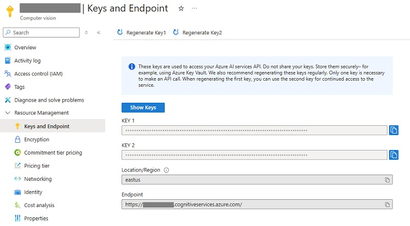
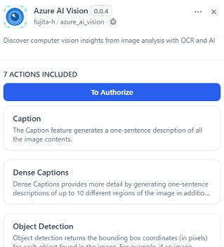
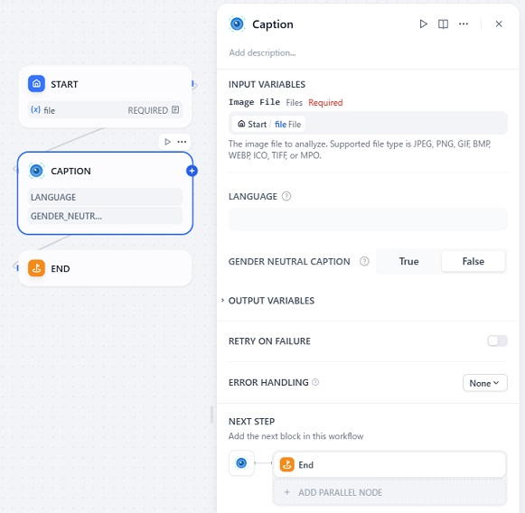

# Overview

This plugin provides tools for image analysis with OCR and AI using Azure AI Vision.

## Important Notice

This plugin requires an Azure subscription. If you don't have an Azure subscription, create a free account before you begin. Learn more about the free trial [here](https://azure.microsoft.com/free/).

# Tools provided by this plugin

Discover computer vision insights from image analysis with OCR and AI.

## Caption

he Caption feature generates a one-sentence description of all the image contents.

Learn more about Caption at [here](https://learn.microsoft.com/azure/ai-services/computer-vision/concept-describe-images-40).

## Dense Caption

Dense Captions provides more detail by generating one-sentence descriptions of up to 10 different regions of the image in addition to describing the whole image. 

Learn more about Dense Caption at [here](https://learn.microsoft.com/azure/ai-services/computer-vision/concept-describe-images-40).

## Object Detection

Object detection returns the bounding box coordinates (in pixels) for each object found in the image. For example, if an image contains a dog, cat, and person, the object detection operation lists those objects with their coordinates in the image.

Learn more about Object Detection at [here](https://learn.microsoft.com/azure/ai-services/computer-vision/concept-object-detection-40).

## People Detection

People detection offers the ability to detect people appearing in images. The bounding box coordinates of each detected person are returned, along with a confidence score.

Learn more about People Detection at [here](https://learn.microsoft.com/azure/ai-services/computer-vision/concept-people-detection).

## OCR

OCR is a machine-learning-based technique for extracting text from in-the-wild and non-document images like product labels, user-generated images, screenshots, street signs, and posters.

Learn more about OCR at [here](https://learn.microsoft.com/azure/ai-services/computer-vision/concept-ocr).

## Smart-Cropping

Smart-Cropping is a reduced-size representation of an image. Smart-Cropping are used to represent images and other data in a more economical, layout-friendly way. The Azure AI Vision 4.0 API uses smart cropping to create intuitive image thumbnails that include the most important regions of an image with priority given to any detected faces.

Learn more about Smart-Cropping at [here](https://learn.microsoft.com/azure/ai-services/computer-vision/concept-generate-thumbnails-40).

## Tags

The tags feature returns content tags for thousands of recognizable objects, living beings, scenery, and actions that appear in images.

Learn more about Tags at [here](https://learn.microsoft.com/azure/ai-services/computer-vision/concept-tag-images-40).

# Configuration

## 1. Create a resource in the Azure portal

Create an Azure Computer vision resource in the Azure portal.

## 2. Get the endpoint and key from the Azure portal

After creating the resource, get the **API Endpoint** and **API Key** from the Azure portal.

## 3. Install the plugin

Install the plugin by clicking on the **Install** button.

## 4. Authorize the plugin

Open the plugin, and click on the **To Authorize** button.

Input the **API Endpoint** and **API Key** you obtained from the Azure portal, and click on the **Save** button.

## 5. Use the tools provided by the plugin

Add tool to the canvas and configure it.

# Notes

This plugin uses the Image Analysis API v4.0 of [Azure AI Vision](https://azure.microsoft.com/products/ai-services/ai-vision/). Please refer to the official documentation for more information.

The functionality provided by this plugin is subject to the requirements and limitations of Azure AI Vision.
Please refer to the [official documentation](https://learn.microsoft.com/azure/ai-services/computer-vision/overview) for more information.

## Input Requirements

Image Analysis API v4.0 have [specific requirements for input images](https://learn.microsoft.com/azure/ai-services/computer-vision/overview-image-analysis?tabs=4-0#input-requirements).

## Region Availability

Image Analysis API v4.0 is limited to [specific regions](https://learn.microsoft.com/azure/ai-services/computer-vision/overview-image-analysis?tabs=4-0#region-availability). 

## Language Support

You can specify the language for output generation by setting the `language` parameter.
If this parameter is not specified, the default value is "en".
See [supported languages](https://learn.microsoft.com/azure/ai-services/computer-vision/language-support) for more information.

# Report Issues and Contributing

Please report any issues to the [GitHub repository](https://github.com/fujita-h/dify-plugin-azure-ai-vision).  
This plugin is open-source and contributions are welcome.
